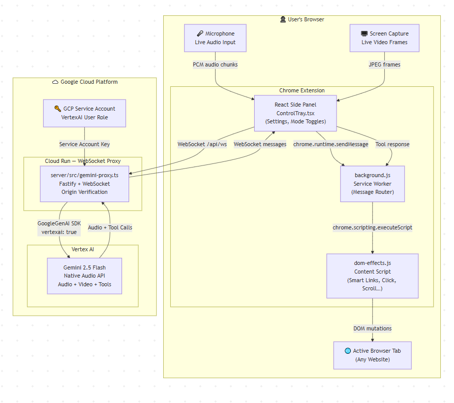

# 🛸 GemiNav AI: The Multimodal Web Co-Pilot

> **Don't just chat with the web. Command it.**
> GemiNav AI is an easily installable Chrome extension that lives in your side panel. With just one click to activate, it becomes a real-time, voice-operated agent that **can see** your active tab, **can watch** you through your webcam, **hears** your voice, and **acts** directly on your browser.

[](https://youtu.be/VJlUh_3kxOY)
*(Click to watch the 2-minute demo)*

## 🏗️ Architecture



## 💡 The Problem & My Solution

**The Problem:** Most AI browser extensions are trapped in a chat box. They require constant copy-pasting. If you ask them to actually *do* something on the page, they hallucinate coordinates and fail. They are passive text generators, not active assistants.

**The Solution:** I built an AI that breaks out of the chat box. GemiNav AI combines multimodal vision with deterministic browser control. It perceives your digital and physical environment in real-time, allowing you to navigate the web, analyze data, and control your browser using natural human speech.

## 🎛️ Voice-First Architecture

While GemiNav features a sleek 6-button "Cockpit" UI in the side panel, **you never actually have to click them**. The entire system is voice-driven.
Just talk to it like a human. Say, *"Look at me,"* and it turns on the camera. Say, *"Read this page,"* and it scans the active tab. The UI simply lights up to show you what senses the Agent is currently using.

### 👁️ The Senses (Inputs)

Tell the Agent what to look at:

* **🎤 MIC:** Full-duplex voice communication. Interrupt the Agent anytime or issue rapid-fire commands hands-free.
* *Use Case:* You are cooking and your hands are dirty. You say, *"Scroll down and read the next step of the recipe."*


* **⬆️ BROWSER:** Grants visual access to your currently active Chrome tab.
* *Use Case:* You are looking at a messy Amazon search page. You say, *"Which of these laptops has the best reviews under $500?"*


* **🖥️ DESKTOP:** Escapes the browser sandbox to see your entire OS screen.
* *Use Case:* You have a system settings window open. You say, *"Look at my screen. What is the exact error code shown in this popup?"*


* **📷 CAMERA:** Activates your physical webcam.
* *Use Case:* You hold up a physical product to the camera and say, *"Search the web for this exact product and tell me where I can buy it."*


### ⚡ The Actions (Power Tools)

What the Agent can execute on your behalf:

* **🔗 SMART LINKS (Deterministic Navigation):**
* *How it works:* The Agent injects high-contrast numeric tags next to every interactive element (links, buttons) on the page. It translates your intent into a flawless click, with zero hallucination.
* *Use Case:* You are on a dense news website. You say, *"Click number 3."* The Agent identifies the exact link tagged with [3] and opens it for you instantly.


* **文 EXPLAIN (Contextual Audio):**
* *How it works:* Highlight any text on the page, and the Agent will instantly read it, translate it, or simplify it directly into your ear.
* *Use Case 1 (Translation):* You highlight a menu on a Japanese website. The Agent instantly speaks the English translation to you.
* *Use Case 2 (Simplification):* You highlight a highly technical or obscure word in a scientific article. You ask, *"Explain this."* The Agent defines the word for you in plain, easy-to-understand language.


## 🛠️ Part 2: How to Install & Run

### 1. Build from Source

```bash
# 1. Clone the repository
git clone https://github.com/Pastew/gemini-hackathon.git
cd gemini-hackathon

# 2. Install dependencies
npm install

# 3. Copy and configure environment variables
cp .env.example .env
# Edit .env with your settings (API key or proxy URL)

# 4. Build the extension
npm run build
```

Then load the extension in Chrome:

1. Open `chrome://extensions/`
2. Toggle on **"Developer mode"** in the top right corner
3. Click **"Load unpacked"** and select the `build/` folder
4. Pin GemiNav to your toolbar and click it to open the Side Panel

### 2. Connection Modes & High Availability

GemiNav AI is built with a "graceful degradation" architecture to ensure you're never disconnected. It supports three ways to connect:

*   **Cloud Proxy (Primary):** By default, the extension connects to a secure WebSocket proxy hosted on **Google Cloud**. This provides the best performance and uses Vertex AI for enterprise-grade Reliability.
*   **Direct API Key (Standard Fallback):** If the cloud server is offline, simply click **Settings (⚙️)** and paste your **Google AI Studio API Key**. The Agent will switch to a direct client-side connection instantly.
*   **Local Proxy (Self-Hosted):** For maximum privacy and control, you can run the proxy server on your own machine:
    1.  Open a terminal in the `/server` directory.
    2.  **Get your Service Account Key:**
        - Go to the [Google Cloud Console](https://console.cloud.google.com/iam-admin/serviceaccounts).
        - Select your project and click **Create Service Account** (e.g., `geminav-local-sa`).
        - Grant it the **Vertex AI User** role.
        - Click on the new service account → **Keys** tab → **Add Key** → **Create New Key** (JSON).
        - Download it and save it as `server/service-account.json`.
    3.  Ensure your `.env` is configured (copy `.env.example`).
    4.  Run `npm install` and then `npm run start`.
    5.  The extension will detect your local server at `ws://localhost:8080` if configured in your extension's `.env`.

---

Made based on [live-api-web-console](https://github.com/google-gemini/live-api-web-console)
